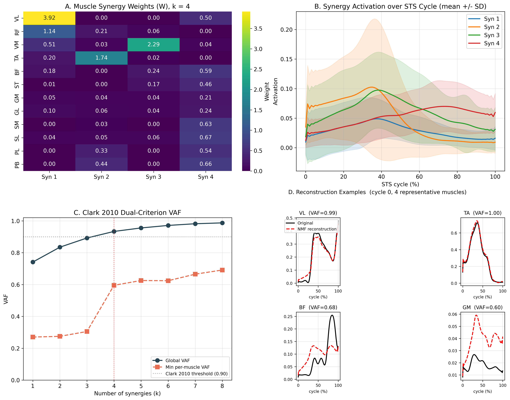

# Muscle Synergy Extraction from Sit-to-Stand EMG

[](https://opensource.org/licenses/MIT)
[](https://www.python.org/downloads/)

A Python implementation of the Clark et al. (2010, *J Neurophysiol*) NMF
muscle synergy protocol, applied to the openly released Gait120 dataset
(Boo et al., 2025, *Sci Data*) and focused specifically on sit-to-stand
(STS) transitions.

> **For reviewers**: headline numbers are in [§ Key Result](#key-result);
> two methodological issues I am currently working through are documented
> in [§ Open Methodological Questions](#open-methodological-questions).

## Motivation

A self-study implementation of the Clark et al. (2010) muscle synergy
protocol, done as preparation for computational research in Parkinson's
disease (PD) rehabilitation. The pipeline focuses on sit-to-stand (STS)
transitions, since STS is a clinically sensitive task for identifying
motor impairment (Yang & An, 2019), and uses non-negative matrix
factorization as the dimensionality-reduction step following the
conventions of the muscle synergy literature.

## Key Result

At **k = 4** on **20 healthy male adults** (Gait120 subjects S001–S020,
99 sit-to-stand cycles, 12 right lower-limb muscles):

- **Global VAF = 0.934**, meeting the global side of Clark et al. (2010)'s
  dual VAF criterion (≥ 0.90).
- **Minimum per-muscle VAF = 0.595** on gastrocnemius medialis (GM), below
  Clark 2010's per-muscle per region threshold of 0.90
  (Clark 2010 p.846: *"If VAF was 90% for each of the eight muscles and
  six regions"*). The per-muscle gap and its biarticular interpretation
  are discussed in [Open Methodological Questions](#open-methodological-questions)
  below.
- Four NMF components distribute across the STS cycle as follows:

| Component                  | Dominant muscles | Peak time (% cycle) |
|----------------------------|------------------|---------------------|
| Anterior compartment       | TA, PB, PL       | 34%                 |
| Lateral quadriceps         | VL, RF           | 37%                 |
| Medial quadriceps          | VM               | 38%                 |
| Late-phase posterior chain | SL, PB, SM, BF   | 73%                 |

*Note on the "Late-phase posterior chain" row*: with Gait120's convention
(see Dataset section below), `SL` and `SM` here are the soleus lateral
and medial heads (both plantarflexors), `PB` is peroneus brevis (foot
eversion, weak plantarflexion), and `BF` is biceps femoris (a hamstring,
knee flexor). Three of the four are plantarflexor-side muscles; BF is
grouped in by the NMF allocation despite being mechanically a hamstring,
which is why this component is labelled by *phase* ("late-phase
posterior chain") rather than by function ("plantarflexor chain").

NMF component ordering is permutation-ambiguous; the labels above are
assigned post hoc from the dominant-muscle structure of this particular
decomposition. **These labels are not the same as the Synergy 1–4
numbering used in Yang & An (2019).** Yang's Synergy 2, for example,
groups TA, RF, VM, and VL together as a single forward-body / hip-rise
module, whereas the table above shows VL/RF and VM separated into two
distinct components in the current decomposition (see
[Open Methodological Questions](#open-methodological-questions)).



*Figure 1. (A) Spatial weight matrix W (12 muscles × 4 components).
(B) Mean ± SD temporal activation H across 99 sit-to-stand cycles.
(C) Global and minimum per-muscle VAF vs. k, with Clark 2010's 0.90
threshold. (D) NMF reconstruction quality for 4 representative muscles
(VL, TA, BF, GM).*

## Open Methodological Questions

Two aspects of the current decomposition are held open and are discussed
as methodological questions rather than findings.

### Provisional VL/VM split observation

At k = 4, the NMF decomposition allocates the vasti to two distinct
components (lateral quadriceps dominated by VL/RF peaking at 37%; medial
quadriceps dominated by VM peaking at 38%), rather than grouping VL and
VM in a single synergy. This is treated as a **provisional methodological
observation rather than a biological finding**, since both directly
relevant prior works group VL and VM together:

- Clark et al. (2010) group VL and VM in a single early-stance
  "weight-acceptance" module in healthy overground walking.
- Yang & An (2019) group TA, RF, VM, and VL in a single Synergy 2
  (forward-body / hip-rise module) in sit-to-stand in both healthy and
  stroke subjects.

The 20-healthy-young-male cohort used here is also not a population in
which a frontal-plane knee-stability explanation would be biomechanically
plausible, since healthy young males have minimal valgus/varus collapse
risk during standard sit-to-stand. Three candidate methodological
explanations are currently being worked through:

1. **NMF solution non-uniqueness**: the current result uses `nndsvda`
   initialization with a single seed; solution stability across many
   random initializations has not yet been tested.
2. **Preprocessing asymmetry**: VL and VM MVC normalization, envelope
   cutoff choice, or surface-electrode cross-talk could induce apparent
   spatial separation without reflecting neural control.
3. **Cohort-level variance accommodation**: individual subjects may have
   slightly different VL/VM relative timing, and NMF may allocate a
   separate component to absorb this variance rather than reflecting a
   population-level biological signal.

Distinguishing these would require (a) a 100+ random-initialization
solution stability test, (b) a preprocessing audit, and (c) a forced
k = 3 ablation to check whether VL and VM recombine when given fewer
components. None of these has been run in the current pipeline.

### Biarticular per-muscle VAF gap

**All five biarticular muscles in the set fall below the 0.90 threshold**,
while every monoarticular muscle that fails (SM, SL, PL, PB) does so by a
smaller margin. In order from worst to best per-muscle VAF:

| Muscle | VAF   | Joints spanned   | Region            |
|--------|-------|------------------|-------------------|
| GM     | 0.595 | knee + ankle     | posterior calf    |
| RF     | 0.618 | hip + knee       | anterior thigh    |
| GL     | 0.645 | knee + ankle     | posterior calf    |
| ST     | 0.657 | hip + knee       | posterior thigh   |
| BF     | 0.683 | hip + knee       | posterior thigh   |

Monoarticular sub-threshold muscles at k = 4: SM 0.668, PL 0.783,
SL 0.812, PB 0.817. Only VL (0.993), TA (0.996), and VM (0.999) meet
Clark's 0.90 criterion.

The RF case is particularly telling. At k = 4, RF is the **second-highest
weight in the Lateral quadriceps component** (W = 1.14, after VL at 3.92);
yet its reconstruction VAF is the second-lowest in the whole set. A
biarticular muscle can sit heavily inside one component and still carry
significant residual variance that no single component absorbs — which
is exactly what a 4-component decomposition is expected to leave behind
when the remaining variance is joint-configuration dependent.

The biarticular mechanism is the same for all five: the same muscle
contraction produces different mechanical effects depending on joint
configuration, and different subjects configure hip, knee, and ankle
differently during STS, so cross-subject variance rises. Two working
hypotheses are being considered:

1. **Biarticular intrinsic difficulty**: the 4-component decomposition
   may be structurally insufficient to capture the joint-configuration-
   dependent variance of biarticular muscles within a single shared
   template set. This has been discussed informally in the synergy
   literature but has not yet been traced to a specific reference.
2. **Preprocessing gap**: the choice of envelope cutoff frequency or MVC
   normalization may be underestimating the true activation range of
   the biarticular muscles.

A k-sweep from k = 1 to k = 8 (see `results/vaf_summary.txt`) shows that
even at k = 8 the minimum per-muscle VAF only reaches 0.691, well below
the 0.90 threshold. The per-muscle side of Clark 2010's dual criterion is
therefore not satisfied at any k in the sweep, and **k = 4 is selected
via the global-side fallback** (smallest k meeting global VAF ≥ 0.90).

## Method

EMG pipeline — described as implemented in `src/preprocess.py`,
`src/normalize.py`, and `src/segment.py`, with every deviation from
Clark et al. (2010) annotated explicitly. Clark 2010 p.845 (right
column) specifies the reference pipeline as *"Muscle activation signals
(EMGs) were high-pass filtered (40 Hz) with a zero lag fourth-order
Butterworth filter, demeaned, rectified, and smoothed with a zero lag
fourth-order low-pass (4 Hz) Butterworth filter. To facilitate
comparisons between subjects and among different walking speeds, the
EMG from each muscle was normalized to its peak value from self-selected
walking and resampled at each 1% of the gait cycle. ... (t = no. of
strides × 101)"*. This repository deviates in five places (labelled
`Deviation #1`, `#2`, `#3`, `#5`, `#6` below, with the gap at #4 because
step 4 matches Clark exactly).

1. **Band-pass 40–450 Hz** (zero-lag 4th-order Butterworth via
   `filtfilt`). **Deviation #1 from Clark 2010**: Clark specifies only
   a 40 Hz high-pass with no explicit upper cutoff. The upper cutoff
   at 450 Hz is added here to suppress additional motion artifact in
   the STS task where trunk acceleration is high. Because the
   downstream 4 Hz envelope low-pass (step 4) dominates the final
   smoothed output, this deviation is functionally near-equivalent in
   the envelope domain.
2. **Notch 60 Hz** (Q = 30). **Deviation #2 from Clark 2010**: not in
   Clark's spec; added for the Gait120 dataset, which was recorded in
   South Korea on a 60 Hz power grid.
3. **Full-wave rectification**. **Deviation #3 from Clark 2010**: Clark
   p.845 specifies *demean before rectification*; the current pipeline
   omits the explicit demean step. Because the preceding zero-lag
   band-pass at 40 Hz already removes the DC component, the explicit
   demean is usually a no-op in practice, but for strict Clark
   alignment it should be added.
4. **Low-pass 4 Hz envelope** (zero-lag 4th-order Butterworth), matching
   Clark 2010 p.845 exactly: *"smoothed with a zero lag fourth-order
   low-pass (4 Hz) Butterworth filter"*.
5. **Per-subject amplitude normalization using Gait120 MVCs**.
   **Deviation #5 from Clark 2010**: Clark normalizes each muscle to
   its *peak value from self-selected walking* (p.845). That approach
   is unavailable here because the Gait120 dataset does not record
   self-selected walking for the STS subjects. MVC-based normalization
   is a principled adaptation: Gait120 provides per-muscle MVC
   recordings as a separate protocol, which gives an equally
   subject-invariant scale factor. An alternative peak-from-STS
   normalization (the ``'max'`` method in `src/normalize.py`) is also
   implemented and is closer to Clark 2010's principle, though still a
   deviation because the task is sit-to-stand rather than walking.
6. Time normalization to **100 points per cycle**
   (`scipy.signal.resample_poly`). **Deviation #6 from Clark 2010**:
   Clark uses 101 points covering 0–100% of the cycle (verbatim from
   Clark 2010 p.845: *"t = no. of strides × 101"*); this pipeline uses
   100 points (off-by-one convention). This is a minor discretization
   choice with negligible impact on NMF decomposition, but it is a
   real off-by-one relative to Clark's spec.
7. NMF decomposition via `sklearn.decomposition.NMF`
   (`init='nndsvda'`, `max_iter=1000`, with a 1 nndsvda + 49 random
   restart policy keeping the lowest-Frobenius-error run). **Note**:
   the restart count is a defensive local choice, not a Clark 2010
   protocol — Clark 2010 does not specify a restart count and cites
   *Lee and Seung 1999* + *Ting and Macpherson 2005* for the NNMF
   algorithm itself.
8. Clark 2010 dual VAF criterion for k selection (global VAF ≥ 0.90 AND
   per-muscle per region VAF ≥ 0.90). When the dual criterion is not
   satisfied at any k in the sweep, the global-side fallback (smallest k
   meeting global ≥ 0.90) is used and the per-muscle shortfall is
   documented as an open question
   (see [Open Methodological Questions](#open-methodological-questions)).
   VAF is computed using the uncentered formulation from
   Torres-Oviedo & Ting (2007).

*Note*: cross-subject synergy alignment via Hungarian matching
(`src/align.py`) is implemented as an auxiliary tool for exploratory
cross-subject analysis (`notebooks/05_cross_subject.py`) and is not
part of the main k-selection pipeline described above.

## Dataset

- **Source**: Gait120 (Boo et al., *Sci Data* 2025, CC BY 4.0)
- **Download**: https://springernature.figshare.com/articles/dataset/27677016
- **Subjects used**: 20 healthy male adults (S001–S020)
- **EMG**: 12 right lower-limb muscles at **2000 Hz**
  (VL, RF, VM, TA, BF, ST, GM, GL, SM, SL, PL, PB)

  > **⚠️ Abbreviation disambiguation (important)**: Gait120 uses
  > non-standard soleus labels. Boo et al. (2025) p.4 verbatim:
  > *"soleus medialis (SM), soleus lateralis (SL), peroneus longus
  > (PL), and peroneus brevis (PB)"*. In this repository, following
  > Boo 2025 exactly:
  > - `GM` = gastrocnemius medialis, `GL` = gastrocnemius lateralis
  > - **`SM` = soleus medialis (medial portion of the soleus), `SL` =
  >   soleus lateralis (lateral portion of the soleus)**. Note: the
  >   soleus is strictly a single muscle and does not anatomically have
  >   two distinct "heads" the way gastrocnemius does; Boo 2025 uses
  >   `medialis`/`lateralis` to refer to two electrode sites over the
  >   medial and lateral portions of the soleus belly, not two separate
  >   heads.
  > - `SM` here is **not** semimembranosus, and `SL` here is **not**
  >   semitendinosus or any other muscle — both labels refer to soleus
  >   electrode sites.
  > - Standard EMG convention would use `SOL` (or `SO`) for soleus and
  >   reserve `SM` for semimembranosus; readers familiar with that
  >   convention should re-parse this repository's tables accordingly.

- **Task**: Sit-to-stand with marker-based STS cycle boundaries (the
  `Step01.TargetFrame` marker within each `Trial0X` defines the cycle endpoint)
- **MVC**: Gait120 provides per-muscle maximum voluntary contractions,
  used directly for per-subject amplitude normalization

### Note on the `.mat` format

Gait120 stores EMG matrices as MATLAB `table` objects serialized via the
`MCOS` / `FileWrapper__` subsystem. Neither `scipy.io.loadmat` nor
`pymatreader` decodes this format automatically. This repository implements
a minimal parser in `src/gait120_mcos.py` that walks the
`__function_workspace__` cell pool, and `src/gait120.py` uses object
reference IDs (ref_id 1–70) to map each trial back to its data cell.

## Repository layout

```
muscle-synergy-sts-nmf/
|-- README.md
|-- LICENSE
|-- environment.yml
|-- requirements.txt
|-- data/
|   |-- processed/            # V matrix cache written by build_v_matrix.py
|-- src/
|   |-- __init__.py
|   |-- gait120.py            # trial loader and ref-id mapping
|   |-- gait120_mcos.py       # minimal MATLAB MCOS / FileWrapper__ parser
|   |-- preprocess.py         # Clark 2010 aligned EMG pipeline
|   |-- segment.py            # STS cycle extraction + time normalization
|   |-- normalize.py          # amplitude normalization helpers
|   |-- nmf_fit.py            # NMF k=1..8 driver with restart logic
|   |-- vaf.py                # global and per-muscle VAF (Clark 2010 dual)
|   |-- align.py              # cross-subject synergy alignment (Hungarian)
|   |-- visualize.py          # Figure 1 (4-panel composite)
|-- scripts/
|   |-- build_v_matrix.py     # preprocess + segment + MVC normalize
|   |-- run_nmf.py            # NMF sweep + Clark 2010 dual criterion
|   |-- make_figure1.py       # render figures/figure1_main.png
|   |-- probe_one.m           # MATLAB utility for manual dataset inspection
|-- notebooks/                # .py files with `# %%` cell markers
|   |-- 01_eda.py
|   |-- 02_preprocess_demo.py
|   |-- 03_nmf_fit.py
|   |-- 04_figure1.py
|   |-- 05_cross_subject.py   # exploratory, not part of the main pipeline
|-- tests/                    # pytest suite for src/ modules
|   |-- __init__.py
|   |-- test_gait120.py       # Gait120 subject loader tests
|   |-- test_preprocess.py    # EMG pipeline tests
|   |-- test_segment.py       # STS cycle extraction tests
|   |-- test_normalize.py     # amplitude normalization tests
|   |-- test_nmf_fit.py       # NMF fit and k-selection tests
|   |-- test_vaf.py           # VAF computation tests
|   |-- test_align.py         # synergy alignment tests
|-- results/
|-- figures/
```

## Reproduce

```bash
conda env create -f environment.yml
conda activate synergy-sts

# Download Gait120 S001-S020 from Figshare and place the extracted
# Gait120_001_to_010/ and Gait120_011_to_020/ folders next to this README.
# https://springernature.figshare.com/articles/dataset/27677016

# Run the pipeline end-to-end
python scripts/build_v_matrix.py   # preprocess + segment + MVC normalize
python scripts/run_nmf.py          # NMF sweep + Clark 2010 dual criterion
python scripts/make_figure1.py     # render figures/figure1_main.png

# Run the test suite
pytest tests/
```

Outputs land in `data/processed/`, `results/`, and `figures/`.

## Limitations

- Healthy male adults only (no female subjects, older adults, or clinical
  populations)
- Right limb only (no bilateral asymmetry)
- No longitudinal sessions (cross-sectional single-visit data only)
- Two open methodological questions are documented separately under
  [Open Methodological Questions](#open-methodological-questions): the
  provisional VL/VM split observation, and the biarticular per-muscle
  VAF gap
- Implementation polish exceeds the author's current ability to write from
  first principles unaided (see Acknowledgments below)

## Acknowledgments

This pipeline was built as a learning project by an applicant transitioning
from the humanities into computational biomechanics, with substantial help
from generative-AI coding assistants (Claude, ChatGPT) used as a learning
partner and pair programmer, alongside online tutorials and the published
methods of Clark et al. (2010) and Yang & An (2019). The design decisions,
the choice of methods (Clark 2010 protocol, dual VAF criterion, Hungarian
alignment), and the interpretation of the results are the author's own;
the implementation polish reflects AI tooling, and the author is still
working hands-on to consolidate her understanding of every design choice.

## Future Work

This pipeline is a preliminary step toward a Master's thesis extending
muscle synergy analysis to Parkinson's disease (PD) longitudinal cohorts.
The planned working hypothesis is **temporal-before-structural degradation**,
informed by Braak staging and Cheung et al.'s (2012) three
**upper-limb post-stroke** synergy reorganization modes (preservation,
merging, and fractionation; Cheung et al. derived this framework from
upper-limb EMG of 31 stroke patients spanning acute to chronic
post-stroke durations, with the fractionation subset restricted to n
= 18 chronic patients per their Fig. 4D, and its direct applicability
to lower-limb STS reorganization in PD is itself one of the empirical
questions this thesis would test). Following Allen et al. (2017, as cited
in Lanzani et al. 2025), the structural features tracked will be **module
distinctness and inter-synergy cosine similarity** rather than synergy
count itself, which Allen showed to be an unreliable marker of
neuromuscular control change in PD.

A first-order prediction, cautiously extrapolated from Yang & An (2019)'s
stroke findings, is that the temporal features of the hip-raising synergy
(Yang & An 2019's Synergy 2, containing TA + RF + VM + VL as a single
forward-body / hip-rise module) will decline earliest in PD due to
bradykinesia. Whether this extrapolation holds across disease mechanisms
(cortical damage in stroke versus basal ganglia dysfunction in PD) is
itself an empirical question the thesis would test.

### Transfer learning note

This Gait120 pipeline will **not** serve as a pretraining substrate for
the planned three-level transfer learning (healthy → stroke → PD),
because Gait120's 12 right lower-limb muscles do not cover the 15-muscle
configuration used by Yang & An (2019). Yang & An (p.2120) measure five
trunk and hip muscles that Gait120 omits entirely — RA (rectus
abdominis), EO (abdominal external oblique), ES (erector spine,
Yang's spelling), GMAX (gluteus maximus), and GMED (gluteus medius) —
while Gait120 adds one distal lower-limb channel (PB, peroneus
brevis) that Yang & An do not use and splits its soleus measurement
into two electrodes (`SM` soleus medialis + `SL` soleus lateralis)
where Yang & An use a single `SOL` channel.

**Medial hamstring mismatch (important)**: Yang & An's `SEMI`
explicitly denotes **semimembranosus** (p.2120, verbatim:
*"biceps femoris long head (BF), semimembranosus (SEMI)"*), whereas
Gait120's `ST` denotes **semitendinosus**. These are two distinct
muscles of the medial hamstring group, adjacent but anatomically
separate; they cannot be treated as interchangeable. Yang & An also
specify `BF` as the **long head** of biceps femoris, whereas Gait120's
`BF` is unspecified (surface EMG typically accesses the long head, so
the overlap is plausible but not guaranteed).

Counting strictly: **nine muscles are shared** across both sets — VL,
RF, VM, TA, BF (Gait120 unspecified ≈ Yang long head), GM/GASM,
GL/GASL, PL/PER, and soleus (Gait120's SM+SL averaged against Yang's
single SOL). Medial hamstring is **not** a shared channel (Yang
records semimembranosus, Gait120 records semitendinosus). Yang-only
(6): RA, EO, ES, GMED, GMAX, SEMI. Gait120-only (3): ST, PB, and the
second soleus electrode. The channel mismatch makes direct encoder
transfer impractical even before the hamstring disambiguation.
Gait120 instead serves as this preliminary self-study substrate, and
the laboratory's own 15-muscle healthy data will be used for Level 1
pretraining.

## Citations

- Clark DJ, Ting LH, Zajac FE, Neptune RR, Kautz SA. Merging of healthy
  motor modules predicts reduced locomotor performance and muscle
  coordination complexity post-stroke. *J Neurophysiol* 2010;
  103:844–857.
- Yang C, An Q, Kogami H, et al. Temporal features of muscle synergies
  in sit-to-stand motion reflect the motor impairment of post-stroke
  patients. *IEEE Trans Neural Syst Rehabil Eng* 2019; 27(10):2118–2127.
- Cheung VCK, Turolla A, Agostini M, et al. Muscle synergy patterns as
  physiological markers of motor cortical damage. *PNAS* 2012;
  109(36):14652–14656.
- Torres-Oviedo G, Ting LH. Muscle synergies characterizing human
  postural responses. *J Neurophysiol* 2007. (Source of the uncentered
  VAF formulation used in `src/vaf.py`.)
- Allen JL, et al. *J Neurophysiol* 2017. (Encountered via Lanzani et al.
  2025; cited for the warning that synergy count alone is not a reliable
  marker of neuromuscular control change in Parkinson's disease.)
- Lanzani V, Brambilla C, Scano A. A methodological scoping review on
  EMG processing and synergy-based results in muscle synergy studies
  in Parkinson's disease. *Front Bioeng Biotechnol* 2025; 12:1445447.
- Boo J, Seo D, Kim M, Koo S. Comprehensive human locomotion and
  electromyography dataset: Gait120. *Sci Data* 2025; 12:1023.

## License

MIT
